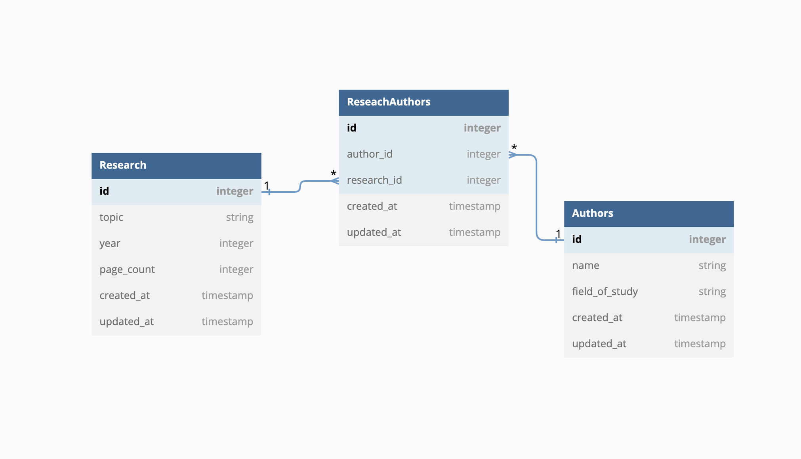

# Flask Mock Code Challenge - Research papers

For this assessment, you'll be working with a Reasearch Author domain.

In this repo, there is a Flask application with some features built out. There
is also a fully built React frontend application, so you can test if your API is
working.

Your job is to build out the Flask API to add the functionality described in the
deliverables below.

## Setup

To download the dependencies for the frontend and backend, run:

```sh
pipenv install
npm install --prefix client
```

There is some starter code in the `app/seed.py` file so that once you've
generated the models, you'll be able to create data to test your application.

You can run your Flask API on [`localhost:5555`](http://localhost:5555) by running:

```sh
python app.py
```

You can run your React app on [`localhost:4000`](http://localhost:4000) by running:

```sh
npm start --prefix client
```

You are not being assessed on React, and you don't have to update any of the React
code; the frontend code is available just so that you can test out the behavior
of your API in a realistic setting.

There are also tests included which you can run using `pytest -x` to check your work.

Depending on your preference, you can either check your progress by:

- Running `pytest -x` and seeing if your code passes the tests
- Running the React application in the browser and interacting with the API via
  the frontend
- Running the Flask server and using Postman to make requests

## Models

You need to create the following relationships:

- A `Research` has many `Author`s through `ResearchAuthors`
- A `Author` has many `Research`s through `ResearchAuthors`
- A `ResearchAuthors` belongs to a `Research` and belongs to a `Author`

Start by creating the models and migrations for the following database tables:



Add any code needed in the model files to establish the relationships.

Then, run the migrations and seed file:

```sh
flask db revision --autogenerate -m'message'
flask db upgrade
python db/seed.py
```

> If you aren't able to get the provided seed file working, you are welcome to
> generate your own seed data to test the application.

## Validations

Add validations to the `Research` model:

- must have a valid 4 digit `year`

Add validations to the `Author` model:

- `field_of_study` must be within the following list
[AI, Robotics, Machine Learning, Vision, Cybersecurity]


## Routes

Set up the following routes. Make sure to return JSON data in the format
specified along with the appropriate HTTP verb.

### GET /research

Return JSON data in the format below:

```json
[
  {
    "id": 1,
    "topic": "AI and Human Interaction",
    "year": 2018,
    "page_count": 500
  },
  {
    "id": 2,
    "name": "Keeping Physical Systems Secure",
    "year": 2013,
    "page_count": 328
  }
]
```

### GET /research/:id

If the `Research` exists, return JSON data in the format below:

```json
{
  "id": 1,
  "topic": "AI and Human Interaction",
  "year": 2018,
  "page_count": 500,
  "authors": [
    {
      "id": 1,
      "name": "John Science",
      "field_of_study": "AI"
    },
    {
      "id": 2,
      "name": "Phil Man",
      "field_of_study": "Machine Learning"
    }
  ]
}
```

If the `Research` does not exist, return the following JSON data, along with
the appropriate HTTP status code:

```json
{
  "error": "Research paper not found"
}
```

### DELETE /research/:id

If the `Research` exists, it should be removed from the database, along with
any `ResearchAuthors`s that are associated with it (a `ResearchAuthors` belongs
to a `Research`, so you need to delete the `ResearchAuthors`s before the
`Research` can be deleted).

After deleting the `Research`, return an _empty_ response body, along with the
appropriate HTTP status code.

If the `Research` does not exist, return the following JSON data, along with
the appropriate HTTP status code:

```json
{
  "error": "Research paper not found"
}
```

### GET /authors

Return JSON data in the format below:

```json
[
  {
    "id": 1,
    "name": "John Science",
    "field_of_study": "AI"
  },
  {
    "id": 2,
    "name": "Phil Man",
    "field_of_study": "Machine Learning"
  }
]
```

### POST /research_author

This route should create a new `ResearchAuthors` that is associated with an
existing `Author` and `Research`. It should accept an object with the following
properties in the body of the request:

```json
{
  "author_id": 1,
  "research_id": 3
}
```

If the `ResearchAuthors` is created successfully, send back a response with the data
related to the `Author`:

```json
{
  "id": 1,
  "name": "John Science",
  "field_of_study": "AI"
}
```

If the `ResearchAuthors` is **not** created successfully, return the following
JSON data, along with the appropriate HTTP status code:

```json
{
  "errors": ["validation errors"]
}
```
